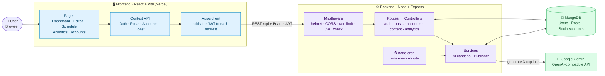
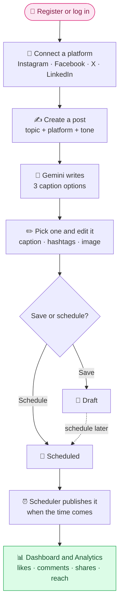
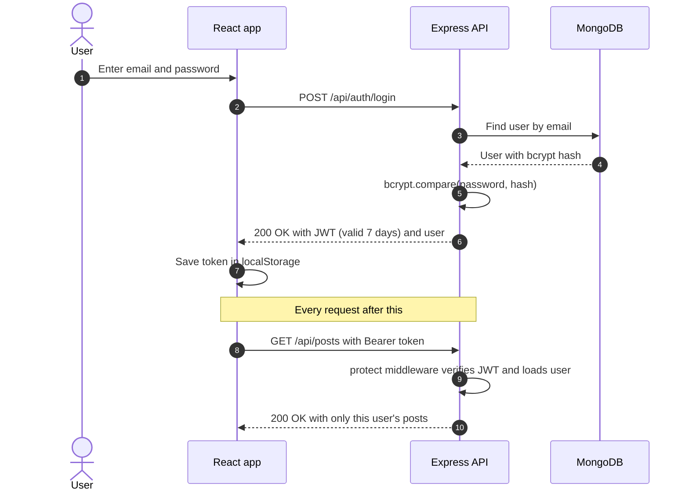
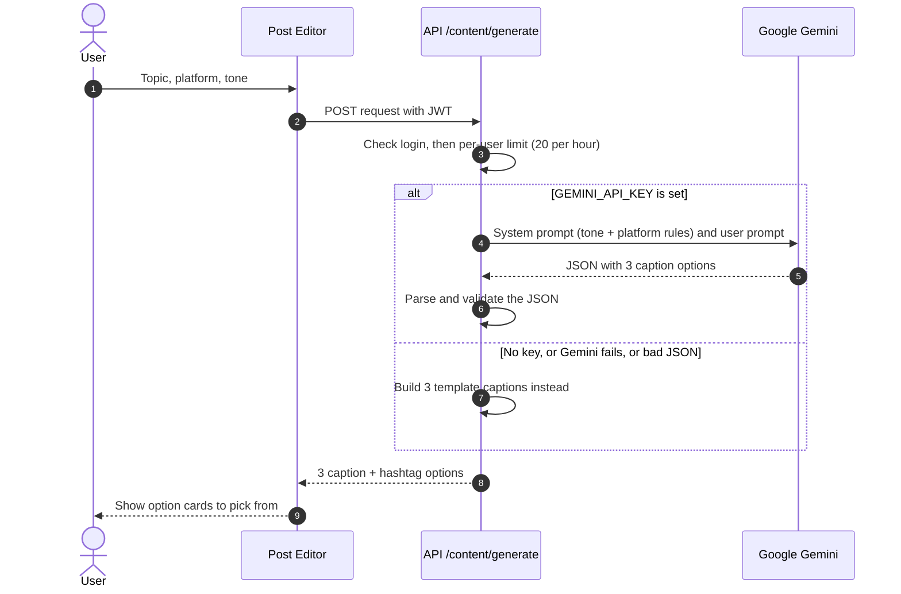
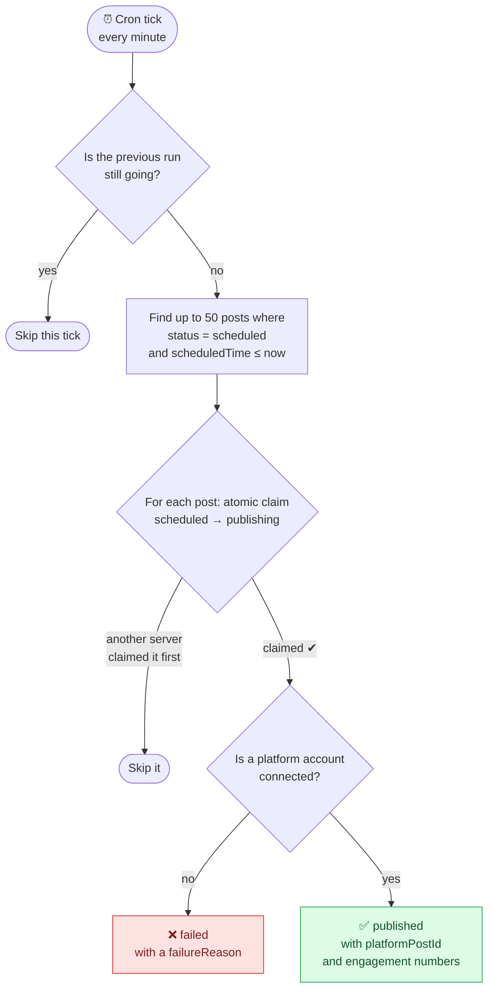
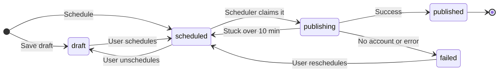
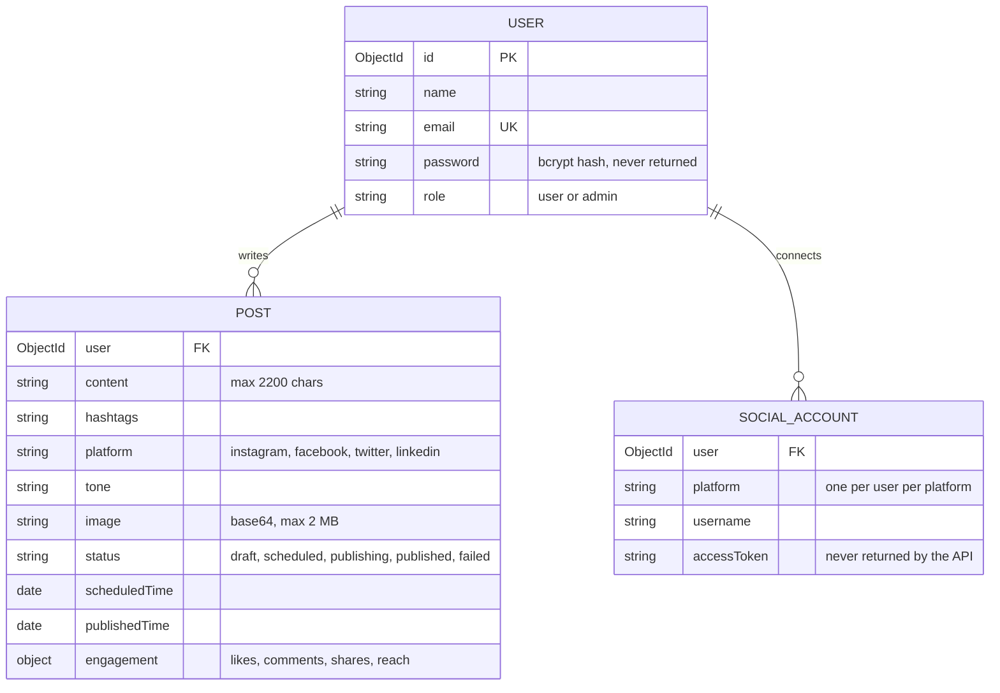
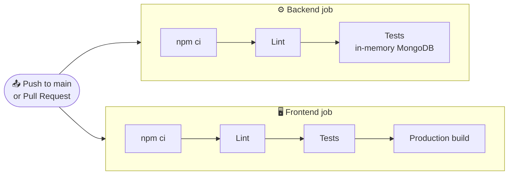

<div align="center">


<br/>

**An AI-powered social media manager: Google Gemini writes the captions, you schedule the posts, and a
dashboard tracks the engagement.**

[](https://github.com/anurag-joshi-1403/Social_Sync_Webapp/actions/workflows/ci.yml)


[Features](#-features) •
[Tech Stack](#-tech-stack) •
[Architecture](#-architecture) •
[How It Works](#-how-it-works) •
[Getting Started](#-getting-started) •
[API](#-api-reference) •
[Explaining the Project](#-explaining-the-project)

</div>

---

## 📖 Overview

Managing Instagram, Facebook, X and LinkedIn means writing captions, remembering when to post, and
checking four different apps to see what worked. **SocialSync puts all three jobs in one place.**

| 😩 The problem | ✅ What SocialSync does |
|---|---|
| Writing good captions takes time | **Gemini AI** writes 3 caption and hashtag options in the tone you pick |
| Posting at the right time is easy to forget | A **scheduler** publishes posts automatically when their time comes |
| Engagement data is spread across apps | One **dashboard** shows likes, comments, shares and reach per day and per platform |

> [!NOTE]
> **Platform publishing is simulated.** Connecting an account doesn't run a real OAuth flow, and nothing
> is sent to the real platforms. When a post's time comes, the scheduler marks it *published* inside
> SocialSync and attaches generated engagement numbers. That means the whole flow can be demoed end to
> end without any platform API keys. Connecting the real platform APIs is the first item on the
> [Roadmap](#-roadmap).

---

## ✨ Features

| | Feature | Details |
|:-:|---|---|
| 🔐 | **Secure auth** | Register and log in with email and password. Passwords are hashed with bcrypt, sessions use JWT, and login attempts are rate limited |
| 🔗 | **Connect accounts** | One account each for Instagram, Facebook, X and LinkedIn *(simulated)* |
| 🤖 | **AI captions** | Enter a topic, platform and tone to get **3 options** from Gemini. There are 5 tones: casual, professional, promotional, inspirational and humorous |
| 🛟 | **Always works** | With no API key, or if Gemini fails, the app falls back to template captions so it never breaks |
| ✏️ | **Post editor** | Edit the caption and hashtags, attach an image (≤ 2 MB), see a live preview, then save as a draft or schedule |
| 📅 | **Calendar** | Month view with colour-coded dots for drafts, scheduled posts and published posts. Click a post to edit or delete it |
| ⏰ | **Auto-publish** | A background job checks every minute for due posts and never publishes the same post twice |
| 📊 | **Analytics** | Charts for the last 7, 14 or 30 days, broken down per day and per platform, plus a table of top posts |
| 🏠 | **Dashboard** | Post counts by status, recent and upcoming posts, and a small engagement chart |

---

## 🧰 Tech Stack

| Layer | Technologies |
|---|---|
| **Frontend** |       |
| **Backend** |     |
| **Database** |   |
| **AI** |  |
| **Testing & DevOps** |     |

> **Also used:** `bcryptjs` (password hashing), `helmet` (security headers), `express-rate-limit`,
> `react-hook-form`, `react-calendar`, Supertest and `mongodb-memory-server` (tests).

---

## 🧩 Architecture

The app has two parts: a **React** single-page app and a **Node/Express** REST API. They talk over HTTP
using a JWT. The API stores everything in **MongoDB**, calls **Gemini** for captions, and runs the
**scheduler** in the same process.



---

## 🔄 How It Works

### The user journey



### 🔐 Login and authentication



### 🤖 AI caption generation



### ⏰ The scheduler

`node-cron` runs every minute inside the API process:



**Why this is safe:**

1. **Atomic claim:** each post is claimed with one `findOneAndUpdate({ _id, status: 'scheduled' })`
   call. If two ticks overlap, or two servers run at once, only one of them gets the post, so it is
   **never published twice**.
2. **Crash recovery:** a post stuck in `publishing` for more than **10 minutes** (for example, because
   the server crashed) is put back to `scheduled`. This check also runs once at startup.

### 📦 Post lifecycle



> Only the **scheduler** can move a post to `published` or `failed`. The API rejects any attempt by a
> user to set those statuses or edit engagement numbers.

### 🗄️ Data model



---

## 📂 Project Structure

```text
Social_Sync_Webapp/
├── backend/                     ⚙️ Node + Express API
│   ├── src/
│   │   ├── server.js            # Entry point: load env, connect DB, start scheduler
│   │   ├── app.js               # Express app: middleware, routes, error handler
│   │   ├── config/db.js         # MongoDB connection
│   │   ├── routes/              # URL → controller mapping
│   │   ├── controllers/         # Request handlers (auth, posts, accounts, content, analytics)
│   │   ├── models/              # Mongoose schemas: User, Post, SocialAccount
│   │   ├── middleware/          # JWT `protect`, rate limiters
│   │   ├── services/            # openaiService (Gemini), publisherService
│   │   ├── jobs/scheduler.js    # node-cron job, runs every minute
│   │   └── utils/               # generateToken
│   └── tests/                   # Vitest + Supertest integration tests
│
├── frontend/                    🖥️ React + Vite app
│   ├── src/
│   │   ├── App.jsx              # Routes (public + protected)
│   │   ├── components/          # auth, dashboard, editor, schedule, analytics, accounts, common
│   │   ├── context/             # AuthContext, PostsContext, AccountsContext, ToastContext
│   │   ├── services/            # Axios wrappers, one per API resource
│   │   ├── constants/           # Platform names, colours and icons
│   │   └── utils/               # Date helpers
│   └── vercel.json              # SPA rewrite so page refresh works
│
├── docs/assets/                 🎨 README images
└── .github/workflows/ci.yml     🤖 Lint + test + build on every push and PR
```

> `backend` and `frontend` are **separate packages**. There's no root `package.json`, so install and run
> each one on its own.

---

## 🚀 Getting Started

### Prerequisites

| Requirement | Notes |
|---|---|
|  | Check with `node -v` |
|  | A free [MongoDB Atlas](https://www.mongodb.com/atlas) cluster or a local `mongod` |
|  | Get one at [aistudio.google.com](https://aistudio.google.com). Without it, the app uses template captions |

### 1️⃣ Clone and install

```bash
git clone https://github.com/anurag-joshi-1403/Social_Sync_Webapp.git
cd Social_Sync_Webapp

cd backend  && npm install
cd ../frontend && npm install
```

### 2️⃣ Set up environment variables

```bash
cp backend/.env.example  backend/.env
cp frontend/.env.example frontend/.env
```

**`backend/.env`**

| Variable | Required | Default | What it's for |
|---|:-:|---|---|
| `MONGODB_URI` | ✅ | — | Atlas SRV string or local `mongodb://` URI |
| `JWT_SECRET` | ✅ | — | Long random string. Generate one with `openssl rand -base64 48` |
| `JWT_EXPIRES_IN` | | `7d` | How long a login token lasts |
| `PORT` | | `5000` | API port |
| `NODE_ENV` | | `development` | `development`, `production` or `test` |
| `CLIENT_URL` | | `http://localhost:5173` | Allowed CORS origins, comma-separated. `*` is a wildcard, as in `https://my-app-*.vercel.app` |
| `GEMINI_API_KEY` | | — | Turns on real AI captions |
| `GEMINI_MODEL` | | `gemini-2.5-flash-lite` | Any Gemini model on the OpenAI-compatible endpoint |
| `GEMINI_BASE_URL` | | Google's endpoint | Change this only if you proxy the API |
| `FORCE_PUBLIC_DNS` | | unset | **Local only.** See [Troubleshooting](#-troubleshooting) |

The `FACEBOOK_*`, `TWITTER_*` and `LINKEDIN_*` variables in `.env.example` are placeholders for future OAuth work. The code doesn't read them yet.

**`frontend/.env`**

| Variable | Default | What it's for |
|---|---|---|
| `VITE_API_URL` | `http://localhost:5000/api` | API base URL, including `/api` |

### 3️⃣ Run it

```bash
# Terminal 1: API on http://localhost:5000
cd backend && npm run dev

# Terminal 2: UI on http://localhost:5173
cd frontend && npm run dev
```

### 4️⃣ Try it out

1. Open **http://localhost:5173** and **register**.
2. Go to **Accounts** and connect a platform. Any username and token work, because connections are simulated.
3. Go to **Create Post**, enter a topic, choose a platform and tone, and click **Generate Content**.
4. Pick an option, tweak it, and **schedule** it 2 minutes from now.
5. Wait a minute past that time. The post turns **published**, and the **Dashboard** and **Analytics** update.

### 📜 Scripts

| Package | Command | What it does |
|---|---|---|
| `backend` | `npm run dev` | Start the API with auto-restart (nodemon) |
| `backend` | `npm start` | Start the API with plain `node` |
| `backend` | `npm test` | Run the tests once (`npm run test:watch` for watch mode) |
| `backend` | `npm run lint` | Lint `src/` and `tests/` |
| `frontend` | `npm run dev` | Start the Vite dev server |
| `frontend` | `npm run build` | Make a production build in `dist/` |
| `frontend` | `npm run preview` | Serve the production build locally |
| `frontend` | `npm test` / `npm run lint` | Run the unit tests, or lint the app |

---

## 🧪 Testing and CI

Backend integration tests cover **auth, posts, the scheduler, analytics and rate limiting**. They
start an **in-memory MongoDB**, so you don't need a database or `.env` to run them:

```bash
cd backend && npm test
```

GitHub Actions runs on every push to `main` and on every pull request:



> The frontend build step catches import-path case mistakes that Windows allows but Linux doesn't.

---

## 📡 API Reference

All routes start with `/api`. Every route except register, login and the health checks needs an
`Authorization: Bearer <jwt>` header. Responses are JSON with a `success` field.

<details>
<summary><b>🔐 Auth</b></summary>

| Method | Path | Description |
|---|---|---|
| `POST` | `/auth/register` | Create an account. Rate limit: 10 failed attempts per 15 min per IP |
| `POST` | `/auth/login` | Get a JWT. Same limit, and successful logins don't count |
| `GET` | `/auth/me` | Get the current user |

</details>

<details>
<summary><b>📝 Posts</b></summary>

| Method | Path | Description |
|---|---|---|
| `GET` | `/posts` | The user's posts. Optional `?status=` and `?platform=` filters. Leaves out `image` to stay fast |
| `POST` | `/posts` | Create a `draft` or `scheduled` post |
| `GET` | `/posts/stats` | Post counts by status |
| `GET` | `/posts/:id` | One post, including its image |
| `PUT` | `/posts/:id` | Edit a post. Only user-allowed status changes are accepted |
| `DELETE` | `/posts/:id` | Delete a post |

</details>

<details>
<summary><b>🔗 Accounts</b></summary>

| Method | Path | Description |
|---|---|---|
| `GET` | `/accounts` | Connected accounts, without tokens |
| `POST` | `/accounts/connect` | Connect a platform. Body: `{ platform, username, accessToken }` *(simulated)* |
| `DELETE` | `/accounts/:platform` | Disconnect a platform |

</details>

<details>
<summary><b>🤖 Content and 📊 Analytics</b></summary>

| Method | Path | Description |
|---|---|---|
| `POST` | `/content/generate` | AI captions. Body: `{ topic, platform, tone }`. Rate limit: 20 per hour per user |
| `GET` | `/analytics?range=7\|14\|30` | Engagement from the user's published posts |

</details>

<details>
<summary><b>💓 Health</b></summary>

| Method | Path | Description |
|---|---|---|
| `GET` | `/` | Liveness check (no `/api` prefix) |
| `GET` | `/api/health` | Uptime and environment |

</details>

---

## 🌍 Deployment

| Part | Where | What to set |
|---|---|---|
| 🖥️ **Frontend** |  | `VITE_API_URL` = your API URL, ending in `/api`. `vercel.json` already sends every route to `index.html` |
| ⚙️ **Backend** | Any Node host (Render, Railway, Fly…) | Run `npm start` in `backend/`. Set `NODE_ENV=production`, `MONGODB_URI`, `JWT_SECRET`, and `CLIENT_URL` (add `https://my-app-*.vercel.app` for preview deploys). **Don't** set `FORCE_PUBLIC_DNS` |

The scheduler starts with the server. Because of the atomic claim, running several instances won't
publish anything twice.

---

## 🩺 Troubleshooting

<details>
<summary><b><code>querySrv ECONNREFUSED</code>: can't connect to MongoDB Atlas locally</b></summary>

Some ISPs fail the Atlas SRV DNS lookup. Set `FORCE_PUBLIC_DNS=true` in `backend/.env` to use Google's
DNS servers. **Use this locally only.** On a hosted server it overrides DNS for the whole process and
breaks internal name lookups.

</details>

<details>
<summary><b>Captions look generic or templated</b></summary>

`GEMINI_API_KEY` is missing or invalid, so the app is using its template fallback. Look in the backend
console for `No GEMINI_API_KEY set` or `Gemini error`.

</details>

<details>
<summary><b>CORS error in the browser</b></summary>

Your frontend's origin isn't in `CLIENT_URL`. Add it (comma-separated) and restart the API.

</details>

<details>
<summary><b><code>413 Request too large</code> when saving a post</b></summary>

Images are limited to 2 MB. Resize the image and try again.

</details>

<details>
<summary><b>A scheduled post never publishes</b></summary>

Check that an account is connected for that post's platform. If not, the post is marked `failed`.
Also make sure the backend is running, since the scheduler only runs inside the API process.

</details>

---

## 🎤 Explaining the Project

A quick guide for presenting SocialSync in a class, demo or interview.

### ⏱️ 30-second pitch

> *"SocialSync is a full-stack MERN app that helps creators and small businesses manage their social
> media from one place. You type a topic, and Google Gemini writes three caption options in the tone
> you choose. You pick one, edit it, and schedule it for Instagram, Facebook, X or LinkedIn. A
> background job publishes it on time, and a dashboard shows how each post performed. Publishing is
> simulated for now, so the whole flow can be demoed without platform API keys."*

### 🧭 2-minute demo script

| Step | Show | Say |
|:-:|---|---|
| 1 | **Register** | "Passwords are hashed with bcrypt, and the server returns a JWT that the app sends with every request." |
| 2 | **Accounts**: connect Instagram | "One account per platform. This step is simulated for now." |
| 3 | **Create Post**: topic *"Diwali sale on handmade candles"*, tone *Promotional* | "The backend sends a tone-specific and platform-specific prompt to Gemini and gets back three options as JSON." |
| 4 | Pick an option, edit it, **schedule** it 2 minutes ahead | "The post is saved with status `scheduled`." |
| 5 | **Schedule** calendar | "Colour-coded dots show drafts, scheduled posts and published posts." |
| 6 | Backend terminal logs | "Every minute, a cron job claims due posts atomically and publishes them." |
| 7 | **Dashboard** and **Analytics** | "Engagement is grouped by day and platform, and the best posts are ranked." |

### 💡 Key engineering decisions

| Decision | Why it matters |
|---|---|
| **Atomic `findOneAndUpdate` claim** in the scheduler | A post can't be published twice, even with overlapping ticks or several servers |
| **Stale-claim recovery** after 10 minutes | If the server crashes mid-publish, the post isn't stuck forever |
| **Template fallback** for AI | The app still works with no API key, a Gemini outage or a malformed AI response |
| **Rate limits:** per **IP** for login, per **user** for AI | Login limits slow down password guessing. AI calls cost money, so they're capped per account |
| **Server-controlled statuses** | A user can't set a post to `published` or edit its engagement numbers |
| **`image` left out of list queries** (with a `hasImage` flag) | Base64 images are large, so leaving them out keeps list pages fast |
| **Secrets never returned** | `password` uses `select: false`, and account tokens are removed by `toSafeObject()` |
| **`app.js` separate from `server.js`** | Tests can load the app without a real database or open port |
| **Compound index `{ status, scheduledTime }`** | Makes the scheduler's every-minute lookup fast |

### ❓ Common questions

<details>
<summary><b>How does authentication work?</b></summary>

On login, the server checks the password with `bcrypt.compare` and returns a signed **JWT** that is
valid for 7 days. The React app stores the JWT and an Axios interceptor adds it to every request as
`Authorization: Bearer <token>`. On the server, the `protect` middleware verifies the token, loads the
user, and every query is filtered by that user's ID. If the token is invalid, the API returns a 401 and
the app logs the user out.

</details>

<details>
<summary><b>How do you make sure a post isn't published twice?</b></summary>

The scheduler doesn't just read due posts and publish them. It **claims** each one with a single atomic
MongoDB update that only succeeds if the status is still `scheduled`, and switches it to `publishing`. If
another tick or another server tried first, the update returns `null` and that post is skipped. There
is also a local `running` flag, so a slow run never overlaps the next tick on the same server.

</details>

<details>
<summary><b>What happens if Gemini is down or returns bad output?</b></summary>

The AI call is wrapped in `try/catch`. If there's no API key, the request fails, or the response isn't
valid JSON in the expected shape, the service returns three **template captions** built from the
topic, tone and platform. The user always gets usable options.

</details>

<details>
<summary><b>Why MongoDB?</b></summary>

Posts are naturally shaped like documents. Nested engagement numbers, optional images and flexible
metadata fit a document better than several joined tables. Mongoose still gives schema validation,
indexes and hooks, such as hashing the password before saving and keeping `hasImage` in sync.

</details>

<details>
<summary><b>How would you connect real Instagram, Facebook, X or LinkedIn publishing?</b></summary>

Add one **adapter per platform** with `publish()` and `fetchMetrics()` methods, plus real OAuth to get
tokens, which should be encrypted at rest. Images would move to object storage such as S3 or
Cloudinary, because platform APIs need a public image URL. A second cron job would pull real engagement
numbers. The current mock would stay as the adapter used in development and tests.

</details>

<details>
<summary><b>How would this scale?</b></summary>

The API is stateless (JWT, with no server sessions), so it can run as several instances behind a load
balancer. The atomic claim already makes it safe to run the scheduler on several instances. Next steps
would be paginating `GET /posts`, moving images out of MongoDB, and eventually moving publishing to a
job queue such as BullMQ with retries.

</details>

---

## 🚧 Known Limitations

- 🔌 **Publishing and OAuth are simulated.** Engagement numbers are randomly generated.
- 🔑 **Access tokens are stored in plain text.** That's harmless while connections are mocked, but they
  must be encrypted before real OAuth is added.
- 🖼️ **Images are stored as base64** inside the post document, with a 2 MB limit.
- 🍪 **JWTs are stored in `localStorage`**, which any script on the page can read.
- 📄 **`GET /posts` has no pagination.**
- 🧪 **Frontend tests are minimal.** Only the date utilities are tested.

## 🎯 Roadmap

- [ ] Real OAuth and one publishing adapter per platform
- [ ] Encrypt tokens at rest, and move JWTs to httpOnly cookies with refresh tokens
- [ ] Object storage for images (S3 or Cloudinary)
- [ ] Engagement sync job that pulls real metrics
- [ ] Multi-platform posts: one submit creates a post for each selected platform
- [ ] Automatic retries with backoff for failed posts
- [ ] Pagination on `GET /posts`
- [ ] Teams and workspaces with an approval flow
- [ ] Frontend component tests and end-to-end tests

---

<div align="center">

Made with ❤️ by **[Anurag Joshi](https://github.com/anurag-joshi-1403)**

⭐ If you found this project useful, consider giving it a star!

</div>
